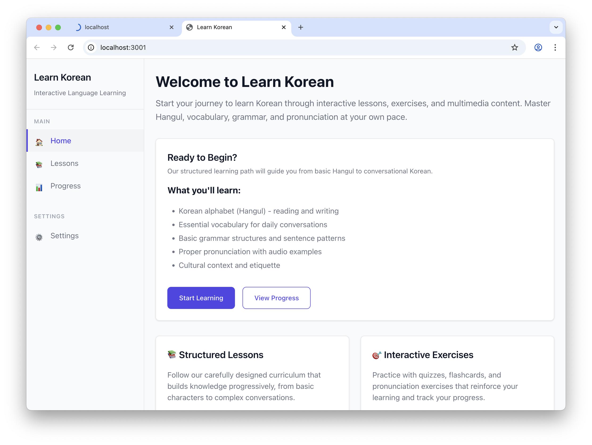
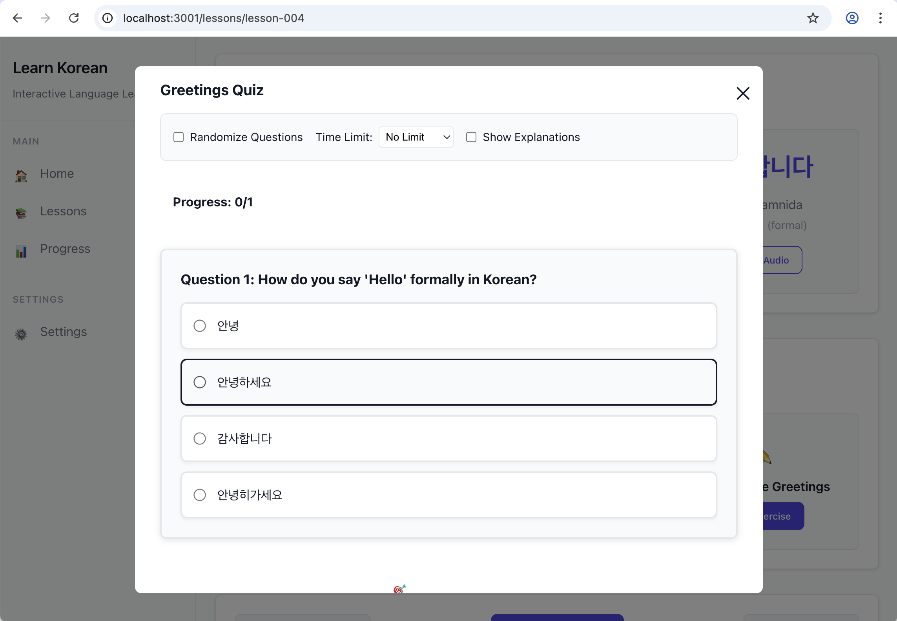

# Learn Korean - Interactive Korean Language Learning Platform

A comprehensive React-based web application designed to help users learn the Korean language through interactive lessons, exercises, and multimedia content.

## 🌟 Features

### 📚 Interactive Lessons
- **Structured Learning Path**: 110+ technical tasks organized across 6 phases from Foundation to Advanced Features
- **Hangul Alphabet**: Complete coverage of Korean consonants and vowels
- **Cultural Context**: Historical background and cultural significance for each lesson
- **Multimedia Support**: Audio pronunciation guides, images, and video content
- **Progressive Difficulty**: Lessons build upon each other with clear prerequisites

### 🎯 Exercise Types
- **Multiple Choice Quizzes**: Interactive quizzes with immediate feedback
- **Flashcards**: Korean-to-English vocabulary practice
- **Pronunciation Practice**: Audio examples for mimicking Korean sounds
- **Listening Exercises**: Audio comprehension activities
- **Typing Exercises**: Practice writing Korean characters
- **Fill-in-the-Blank**: Context-based vocabulary exercises
- **Drag & Drop**: Interactive character and word arrangement

### 📊 Progress Tracking
- **Local Storage**: Persistent progress tracking using browser localStorage
- **Completion Tracking**: Monitor completed lessons and exercise scores
- **Performance Analytics**: Detailed progress analysis and recommendations
- **Learning Path Recommendations**: Personalized suggestions based on progress

### 🎨 User Experience
- **Responsive Design**: Works seamlessly across desktop and mobile devices
- **Error Handling**: Comprehensive error boundaries and user-friendly error messages
- **High Contrast Mode**: Accessibility features for better visibility
- **Keyboard Shortcuts**: Efficient navigation for power users
- **Content Protection**: Secure asset delivery and content integrity checking

## 📱App Screenshots

### Main Interface



### Exercise Examples



## 🚀 Getting Started

### Prerequisites
- Node.js (v14 or higher)
- npm or yarn package manager

### Installation

1. **Clone the repository**
   ```bash
   git clone <repository-url>
   cd learn-korean
   ```

2. **Install dependencies**
   ```bash
   npm install
   ```

3. **Start the development server**
   ```bash
   npm run dev
   ```
   The application will be available at `http://localhost:3000`

4. **Build for production**
   ```bash
   npm run build
   ```

5. **Preview production build**
   ```bash
   npm run preview
   ```
   The production build will be available at `http://localhost:4173`

## 📁 Project Structure

```
learn-korean/
├── public/                     # Static assets
│   └── assets/                # Audio, images, and video files
├── src/
│   ├── components/            # React components
│   │   ├── exercises/         # Exercise-specific components
│   │   ├── Layout.jsx         # Main layout component
│   │   ├── LessonPreview.jsx  # Lesson preview component
│   │   └── ErrorBoundary.jsx  # Error handling component
│   ├── data/
│   │   └── lessons.json       # Lesson content and structure
│   ├── pages/                 # Page components
│   ├── hooks/                 # Custom React hooks
│   ├── utils/                 # Utility functions
│   ├── styles/                # CSS and styling files
│   ├── App.jsx                # Main application component
│   └── main.jsx               # Application entry point
├── docs/                      # Documentation
│   ├── tasks.md              # Development tasks (110 items)
│   ├── quiz-tasks.md         # Quiz-specific tasks (49 items)
│   ├── requirements.md       # Project requirements
│   └── plan.md               # Development plan
└── dist/                     # Production build output

## 📸 UI Components Preview

### Navigation Elements


### Interactive Elements


```

## 📖 Lesson Structure

Each lesson in the `lessons.json` file follows this comprehensive structure:

```json
{
  "id": "lesson-001",
  "title": "Introduction to Hangul",
  "level": "beginner",
  "category": "pronunciation",
  "description": "Learn the basics of the Korean alphabet.",
  "prerequisites": [],
  "nextLessons": ["lesson-002"],
  "estimatedTime": 15,
  "culturalContext": {
    "historicalBackground": "Historical context...",
    "culturalSignificance": "Cultural importance...",
    "modernRelevance": "Modern applications...",
    "etiquette": "Cultural etiquette notes..."
  },
  "content": {
    "text": "Lesson content...",
    "examples": [
      {
        "korean": "ㄱ",
        "romanization": "g/k",
        "translation": "Consonant G/K",
        "audio": "/assets/audio/g.mp3"
      }
    ],
    "media": {
      "image": "/assets/images/hangul-chart.jpg",
      "video": null
    }
  },
  "exercises": [
    {
      "type": "quiz",
      "title": "Hangul Recognition Quiz",
      "questions": [...]
    }
  ]
}
```

## 🛠️ Technology Stack

- **Frontend Framework**: React 18.2.0
- **Build Tool**: Vite 5.0.8
- **Routing**: React Router DOM 6.8.1
- **Validation**: AJV 8.17.1
- **Styling**: CSS with responsive design
- **Development**: ESLint, Prettier for code quality

## 🎯 Development Phases

The project is organized into 6 development phases:

1. **Phase 1: Foundation** - Data structures, error handling, performance optimization
2. **Phase 2: Content Management** - Lesson management, multimedia integration
3. **Phase 3: User Interface** - Component development, responsive design
4. **Phase 4: Interactive Features** - Exercises, progress tracking
5. **Phase 5: Advanced Features** - Analytics, recommendations, accessibility
6. **Phase 6: Polish & Optimization** - Testing, documentation, deployment

**Start your Korean learning journey today!** 🇰🇷

Run `npm run dev` to begin exploring the interactive lessons and exercises.